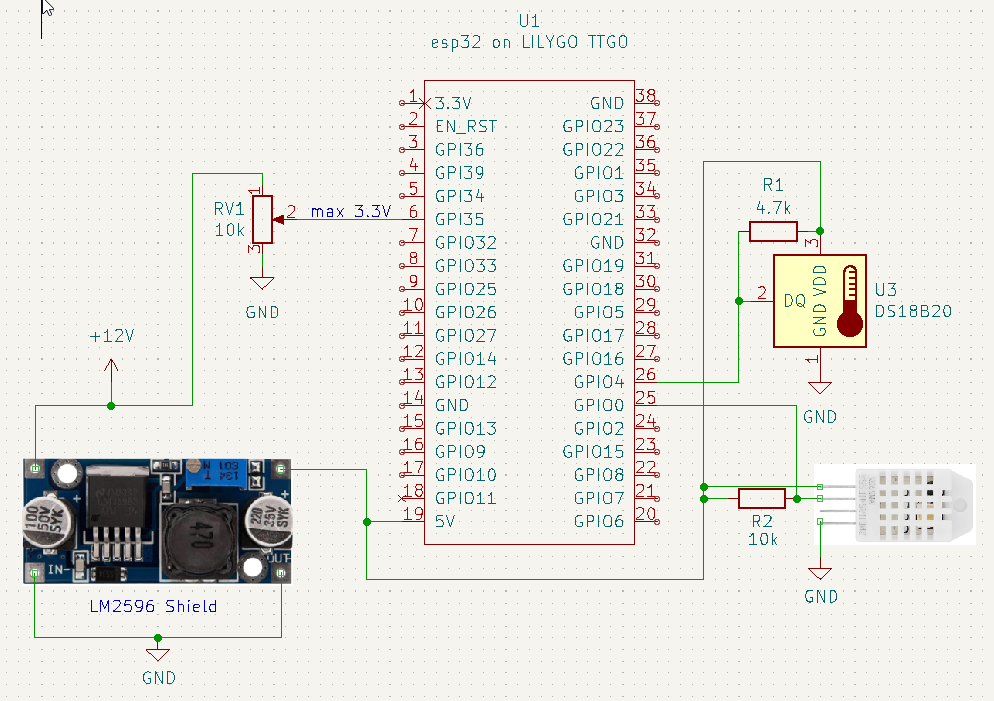
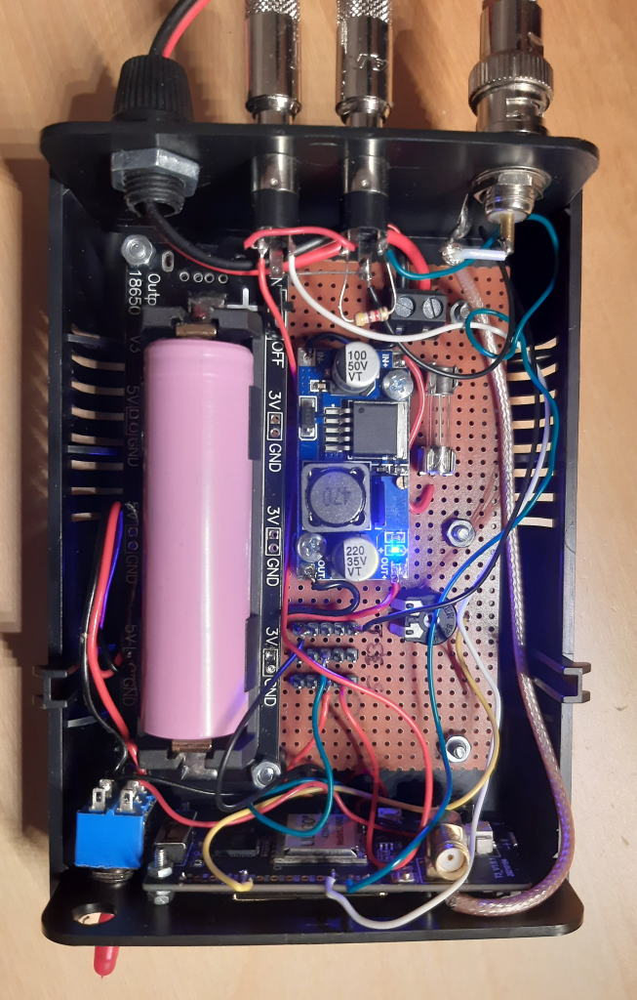
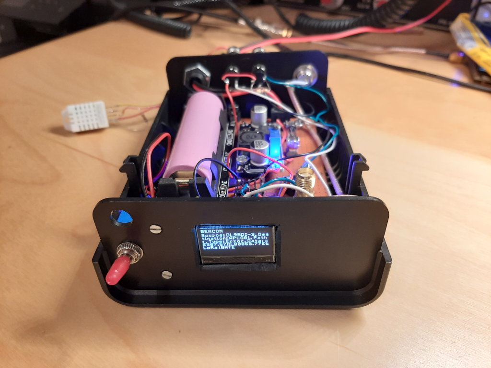
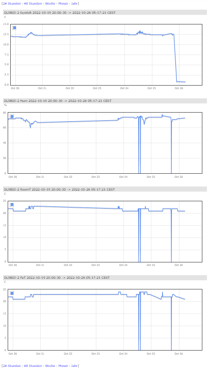

# LoRa APRS iGate with rf telemetry beacon

### Origin
Peter Buchegger, OE5BPA, did a great job in providing software for LoRa devices so that they could be used as 
as iGate or Tracker. This project is a fork of Peter's LoRa iGate project to add the functionality of a radio beacon.
Peters original project can be found here: [LoRa_APRS_iGate_OE5BPA](https://github.com/lora-aprs/LoRa_APRS_iGate)

### Addition
iGates often operate autonomously at locations such as a repeater site, which acts as a gateway for other LoRa stations 
such as trackers to aprs.fi to present location information or other APRS data.
The path of the data goes from rf side to the internet.

It would be great if such an iGate would also be able to send status information about the repeater location via radio.
This data could then be received by other LoRa iGate stations and displayed on aprs.fi.

The idea behind this is to have a decoupled information channel to monitor the repeater equipment and environment. Even if the 
internet connection to the repeater site fails and remote access is not possible, one can at least see if the repeater is working in general.

If the iGate hardware is buffered by a battery one could even detect power outages at the repeater site.

This project contains modifications to Peters code that realize such a radio beacon. It reads out several sensors connected to the iGate ESP board
* one DHT22 sensor to measure humidity and temperature at the site
* one DS18B20 sensor e.g. to be placed at transmitters pa to measure its hardware temperatures
* one direct voltage measurement pin to read out the site's power supply

The measures values are send out by the radio module of the iGate as regular APRS message and can be viewed on aprs.fi.

It is possible to configure a separate outgoing call (e.g. CALL-2) to be able to destinguish between iGate and telemetry

Up to know this version ha a protoype status and has to be optimized and refined - but it is working for me.

### Schematic

The picture show a rough schematic how to connect temperature sensors to available io ports on the LoRa device


The LM2596 is only an example of a step down regulator to get 5V necessary to drive the LoRa device. Should be used in
form of such cheap shields.
RV1 must be adjusted limit the input of GPIO35 to a maximum of 3.3V. It would be even better to set it in 
a way that e.g. 17V Input results in 3.3V at GPIO to have some buffer for overvoltages. The value of this 
maximum can be configured in *is-cfg.json*

### Setup

The pictures shows a prototype setup




In this setup a 18650 backup battery included on a suitable shield. If there is a voltage failure at 
the repeater site this battery allows sending out telemetry data for at least 1-2 days. 

### Configuration
Sensors are read out at GPIO ports of the processor. These have to be defined at build time and can not be 
configured in the config file. The ports are defined in *TaskBeacon.ccp*

```Java
//define IO ports for measurements
#define DHT22PORT    0
#define DS18PORT     4
#define VOLTAGEPORT 35
```

Further configuration can be done in *is-cfg.json*

```json
	"telemetry": {
		"active": true,
		"voltage_scaling": 17,
		"telemetry_call": "NOCALL-2",
		"numeric_only": true
	},
```

* *active*: activates sending out beacons on rf
* *voltage_scaling*: sets the value that is transmitted for an input value of 3.3V at voltage measurement port
* *telemetry_call*: sender call for rf beacon transmissions
* *numeric_only*: if set to **true** the measurements are send out in aprs telemetry format so that they can be 
displayed on telemetry diagrams on *aprs.fi*. If set to **false** the values are send as human readible string.  

Example of telemetry data on aprs.fi



Disclaimer als always: use at your own risk ;) 

vy73 de Matthias, DL9BDI

